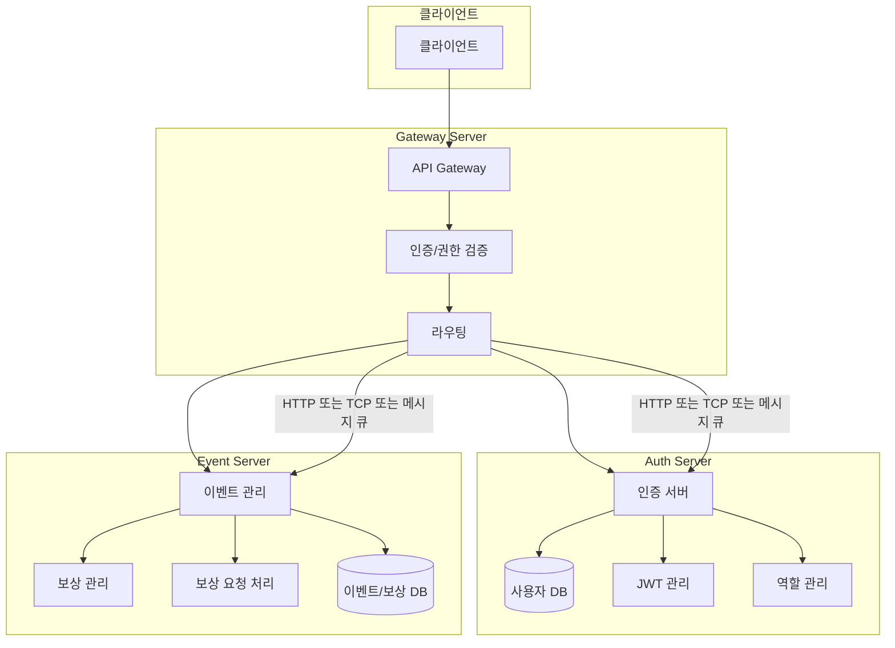

# 이벤트/보상 관리 시스템

NestJS + MSA + MongoDB 기반의 이벤트/보상 관리 시스템입니다.

## 시스템 구조

이 프로젝트는 다음과 같은 3개의 서버로 구성됩니다:

1. **Gateway Server**: 모든 API 진입점, JWT 검증 및 역할(Role) 검사
2. **Auth Server**: 사용자 관리, 인증, JWT 발급
3. **Event Server**: 이벤트 관리, 보상 관리, 조건 검증



## 실행 방법

### 사전 요구사항

- Docker
- Docker Compose

### 설치 및 실행

1. 저장소 클론

```bash
git clone https://github.com/your-username/event-reward-platform.git
cd event-reward-platform
```

2. Docker Compose로 서비스 시작

```bash
docker-compose up -d
```

3. 서비스 접근

- Gateway API: http://localhost:3004
- Auth API: http://localhost:3001
- Event API: http://localhost:3002

### 인증

- 모든 API는 JWT 토큰을 통한 인증이 필요합니다 (로그인, 회원가입, 이벤트-보상 조회 제외)
- 토큰은 `Authorization: Bearer {token}` 형식으로 전달해야 합니다

## 설계 선택 이유

### 1. MSA (Microservice Architecture) 선택 이유

- **서비스 분리**:
  - 인증/사용자 관리(Auth Server)와 이벤트/보상 관리(Event Server)를 분리
  - 각 서비스의 독립적인 배포와 확장 가능
  - 서비스별 장애 격리로 전체 시스템 안정성 향상

### 2. 이벤트/보상 시스템 설계

- **이벤트 상태 관리**:

  - DRAFT, ACTIVE, INACTIVE, COMPLETED 상태로 명확한 이벤트 라이프사이클 관리
  - 이벤트 시작일/종료일 검증으로 유효한 이벤트 기간 보장

- **조건 검증 시스템**:

  - 다양한 조건 타입 지원 (CONTINUOUS_LOGIN, FRIEND_INVITE, CUSTOM)
  - MongoDB Aggregation Pipeline을 활용한 효율적인 조건 검증
  - 실패한 청구에 대한 상세 로깅 및 추적

- **보상 시스템**:
  - POINT, ITEM, COUPON 등 다양한 보상 타입 지원
  - 이벤트별 다중 보상 설정 가능
  - 보상 지급 실패 시 재시도 메커니즘 구현 예정

### 3. API 구조 선택

- **RESTful API + Message Pattern**:
  - 마이크로서비스 간 통신을 위한 Message Pattern 사용
  - 명확한 커맨드 기반의 API 설계 (create_reward, find_rewards_by_event 등)
  - DTO를 통한 엄격한 데이터 검증

### 4. 데이터베이스 선택

- **MongoDB**:
  - 스키마 유연성으로 다양한 이벤트 조건 저장 가능
  - Aggregation Pipeline을 통한 복잡한 쿼리 처리
  - 이벤트-보상 관계의 효율적인 조회

### 5. 보안 설계

- **JWT 기반 인증**:
  - Stateless 인증으로 서버 확장성 확보
  - Role 기반 접근 제어 (OPERATOR, AUDITOR, ADMIN)
  - API Gateway를 통한 중앙화된 인증/인가

### 6. 메시지 큐 도입

#### 6.1 도입 배경

- TCP 기반 통신의 한계:
  - Auth Server 장애 시 메시지 유실 문제
  - 서비스 간 강한 결합도
  - 장애 상황에서의 복구 어려움

#### 6.2 RabbitMQ 구현

- **Gateway Server의 Auth Proxy Module**:

  ```typescript
  @Module({
    imports: [
      ClientsModule.registerAsync([
        {
          name: 'AUTH_SERVICE',
          inject: [ConfigService],
          useFactory: (configService: ConfigService) => ({
            transport: Transport.RMQ,
            options: {
              urls: configService.getOrThrow('RABBITMQ_URI'),
              queue: 'auth',
            },
          }),
        },
      ]),
    ],
  })
  ```

- **Event Server의 Auth Client Module**:

  ```typescript
  @Module({
    imports: [
      ClientsModule.registerAsync([
        {
          name: 'AUTH_SERVICE',
          imports: [ConfigModule],
          inject: [ConfigService],
          useFactory: (configService: ConfigService) => ({
            transport: Transport.RMQ,
            options: {
              urls: configService.getOrThrow('RABBITMQ_URI'),
              queue: 'auth',
            },
          }),
        },
      ]),
    ],
  })
  ```

- **Event Server의 메인 설정**:
  ```typescript
  const options: RmqOptions = {
    transport: Transport.RMQ,
    options: {
      urls: configService.getOrThrow("RABBITMQ_URI"),
      queue: "event",
    },
  };
  ```

#### 6.3 메시지 큐 동작 방식

- **메시지 지속성**:

  - RabbitMQ는 기본적으로 메시지를 디스크에 저장
  - 서버 장애 시에도 메시지가 유실되지 않음
  - 서버 재시작 시 자동으로 미처리된 메시지 처리

- **서비스 간 통신**:
  - Auth Service: 'auth' 큐를 통해 통신
  - Event Service: 'event' 큐를 통해 통신
  - Gateway Server: 두 큐 모두와 통신

#### 6.4 장애 대응

- **자동 복구**:

  - 서버 장애 시 메시지는 RabbitMQ에 보관
  - 서버 재시작 시 자동으로 미처리된 메시지 처리
  - 별도의 재시도 로직 없이도 메시지 처리 보장

- **서비스 독립성**:
  - 각 서비스는 독립적인 큐를 사용
  - 서비스 장애가 다른 서비스에 영향을 주지 않음
  - 비동기 처리로 시스템 안정성 향상

#### 6.5 도입 효과

- **안정성 향상**:

  - 서비스 장애 시 메시지 유실 방지
  - 자동 복구 메커니즘
  - 서비스 간 독립성 확보

- **확장성 개선**:
  - 서비스 간 느슨한 결합
  - 새로운 서비스 추가 용이
  - 부하 분산 용이

#### 6.6 향후 개선 사항

- **메시지 큐 고도화**:

  - Dead Letter Queue 도입
  - 메시지 우선순위 설정
  - 메시지 TTL 설정

- **모니터링 강화**:
  - 큐 크기 모니터링
  - 메시지 처리 지연 시간 추적
  - 장애 상황 알림 시스템 구축

### 7. keySet 페이징 도입
- **기존 페이징 방식**:
  - Offset 기반 페이징 (SKIP, LIMIT)
  - 대량 데이터 처리 시 성능 저하
  - 필요없는 데이터를 메모리에 로드 하고 버리는 비효율적인 동작방식
  - 데이터가 많아질수록 성능 저하 심화

- **keySet 페이징**:
- **keySet 기반 페이징**:
  - 이전 페이지의 마지막 키를 기준으로 다음 페이지 조회
  - 성능 향상 및 데이터 일관성 보장
  - MongoDB의 `_id` 필드를 기준으로 구현
  - 데이터가 많아지더라도 limit 만큼의 데이터만 메모리에 로드

### 8. 향후 개선 사항

- 보상 지급 처리 로직 구현
- 메시지 큐 도입을 통한 비동기 처리 강화
- 모니터링 및 로깅 시스템 구축
- 테스트 자동화 강화
