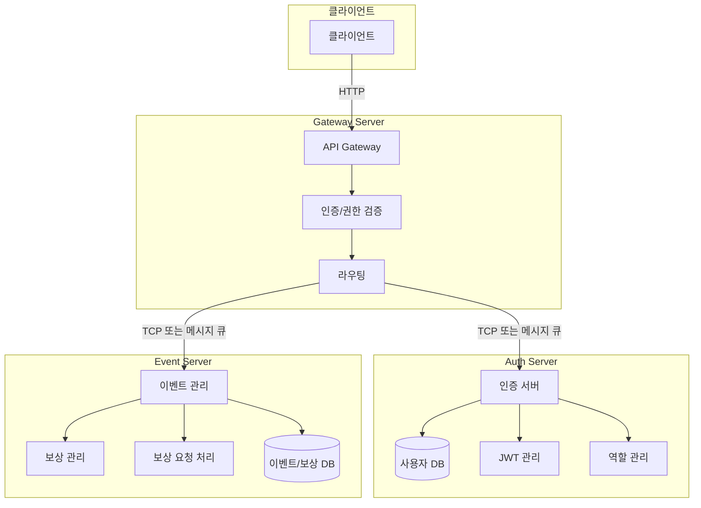

# 이벤트/보상 관리 시스템

NestJS + MSA + MongoDB 기반의 이벤트/보상 관리 시스템입니다.

## 시스템 구조

이 프로젝트는 다음과 같은 3개의 서버로 구성됩니다:

1. **Gateway Server**: 모든 API 진입점, JWT 검증 및 역할(Role) 검사
2. **Auth Server**: 사용자 관리, 인증, JWT 발급
3. **Event Server**: 이벤트 관리, 보상 관리, 조건 검증



## 실행 방법

### 사전 요구사항

- Docker
- Docker Compose

### 설치 및 실행

1. 저장소 클론

```bash
git clone https://github.com/DongHoonYu96/event-reward-platform.git
cd event-reward-platform
```

2. Docker Compose로 서비스 시작

```bash
docker-compose up -d
```

3. 서비스 접근

- Gateway Server: http://localhost:3004
- API 문서 : http://localhost:3004/api
- Auth Server: rmq로 접근 (3001 : swagger용 포트)
- Event Server: rmq로 접근 (3002 : swagger용 포트)

### 인증

- 모든 API는 JWT 토큰을 통한 인증이 필요합니다 (로그인, 회원가입, 이벤트-보상 조회 제외)
- 토큰은 `Authorization: Bearer {token}` 형식으로 전달해야 합니다

## 설계 선택 이유

### 1. MSA (Microservice Architecture) 선택 이유

- **서비스 분리**:
  - 인증/사용자 관리(Auth Server)와 이벤트/보상 관리(Event Server)를 분리
  - 각 서비스의 독립적인 배포와 확장 가능
  - 서비스별 장애 격리로 전체 시스템 안정성 향상

### 2. 이벤트/보상 시스템 설계

- **이벤트 상태 관리**:

  - DRAFT, ACTIVE, INACTIVE, COMPLETED 상태로 명확한 이벤트 라이프사이클 관리
  - 이벤트 시작일/종료일 저장하여 이벤트 조건 검사등에 활용

- **조건 검증 시스템**:

  - 다양한 조건 타입 지원 (CONTINUOUS_LOGIN, FRIEND_INVITE, CUSTOM)
  - MongoDB Aggregation Pipeline을 활용한 효율적인 조건 검증
  - 실패한 청구에 대한 상세 로깅 및 추적

- **보상 시스템**:
  - POINT, ITEM, COUPON 등 다양한 보상 타입 지원
  - 이벤트별 다중 보상 설정 가능
  - 보상 지급 실패 시 재시도 메커니즘 구현 예정

### 3. API 구조 선택

- **RESTful API + Message Pattern**:
  - 마이크로서비스 간 통신을 위한 Message Pattern 사용
  - 명확한 커맨드 기반의 API 설계 (create_reward, find_rewards_by_event 등)
  - 간단한 설정 변경만으로 TCP, RMQ, Kafka 등으로 통신 방식 변경 가능
    
  - 
    
### 4. 데이터베이스 선택

- **MongoDB**:
  - 기획이 변경되어도 유연한 스키마 설계 가능(필드 추가/삭제 용이)
  - 스키마 유연성으로 다양한 이벤트 조건 저장 가능 ()

### 5. 보안 설계

- **JWT 기반 인증**:
  - Stateless 인증으로 서버 확장성 확보
  - 별도의 세션 관리 필요 없음
  - 다중 서버 환경에서도 유연하게 동작
  - Role 기반 접근 제어 (OPERATOR, AUDITOR, ADMIN)
  - API Gateway를 통한 중앙화된 인증/인가

### 6. 메시지 큐 도입

#### 6.1 도입 배경

- TCP 기반 통신의 한계:
  - 특정 서버 장애 시 메시지 유실 문제 발생
  - 서비스 간 강한 결합도
  - 장애 상황에서의 복구 어려움

#### 6.2 RabbitMQ 구현
- 아래와 같이 간단한 설정 변경만으로 TCP 방식에서 RabbitMQ 방식으로 변경 가능
- **Gateway Server의 Auth Proxy Module**:

  ```typescript
  @Module({
    imports: [
      ClientsModule.registerAsync([
        {
          name: 'AUTH_SERVICE',
          inject: [ConfigService],
          useFactory: (configService: ConfigService) => ({
            transport: Transport.RMQ,
            options: {
              urls: configService.getOrThrow('RABBITMQ_URI'),
              queue: 'auth',
            },
          }),
        },
      ]),
    ],
  })
  ```

- **Auth Server의 메인 설정**:
  ```typescript
  const options: RmqOptions = {
    transport: Transport.RMQ,
    options: {
      urls: configService.getOrThrow("RABBITMQ_URI"),
      queue: "auth",
    },
  };
  ```

#### 6.3 메시지 큐 동작 방식

- **메시지 지속성**:

  - RabbitMQ는 기본적으로 메시지를 디스크에 저장
  - 서버 장애 시에도 메시지가 유실되지 않음
  - 서버 재시작 시 자동으로 미처리된 메시지 처리

- **서비스 간 통신**:
  - Auth Service: 'auth' 큐를 통해 통신
  - Event Service: 'event' 큐를 통해 통신
  - Gateway Server: 두 큐 모두와 통신

#### 6.4 장애 대응

- **자동 복구**:

  - 서버 장애 시 메시지는 RabbitMQ에 보관
  - 서버 재시작 시 자동으로 미처리된 메시지 처리
  - 별도의 재시도 로직 없이도 메시지 처리 보장

- **서비스 독립성**:
  - 각 서비스는 독립적인 큐를 사용
  - 서비스 장애가 다른 서비스에 영향을 주지 않음
  - 비동기 처리로 시스템 안정성 향상

#### 6.5 도입 효과

- **안정성 향상**:

  - 서비스 장애 시 메시지 유실 방지
  - 자동 복구 메커니즘
  - 서비스 간 독립성 확보

- **확장성 개선**:
  - 서비스 간 느슨한 결합
  - 새로운 서비스 추가 용이
  - 부하 분산 용이


### 7. keySet 페이징 도입
- **기존 페이징 방식**:
  - Offset 기반 페이징 (SKIP, LIMIT)
  - SKIP 할 데이터를 메모리에 로드 하고 버리는 비효율적인 동작방식
  - 데이터가 많아질수록 성능 저하 심화

- **keySet 기반 페이징**:
  - 이전 페이지의 마지막 키를 기준으로 다음 페이지 조회
  - 성능 향상 및 데이터 일관성 보장
  - MongoDB의 `_id` 필드를 기준으로 구현
  - 데이터가 많아지더라도 limit 만큼의 데이터만 메모리에 로드
  - 몽고 db의 '_id' 필드는 시간순으로 정렬되어 있어, 최근 데이터를 쉽게 조회 가능 (별도의 createdAt 인덱싱 불필요)

### 8. 조건 검증 방식

#### 8.1 조건 구조
```typescript
interface EventCondition {
    type: ConditionType;    // 조건 타입 (CONTINUOUS_LOGIN, FRIEND_INVITE 등)
    value: number;          // 조건 값 (횟수, 금액 등)
    description: string;    // 조건 설명
}

export enum ConditionType {
    CONTINUOUS_LOGIN = 'CONTINUOUS_LOGIN',
    FRIEND_INVITE = 'FRIEND_INVITE',
    CUSTOM = 'CUSTOM',
    // 향후 확장 가능
}
```

#### 8.2 확장성 고려사항
- 새로운 조건 타입 추가가 용이한 구조
- 각 조건 타입별 검증 로직 분리
- 조건 값의 유연한 설정 가능

### 9. 출석 집계 시스템

#### 9.1 출석 데이터 저장
```typescript
// User 스키마
@Schema()
export class User {
    @Prop({ type: [String], default: [] })
    attendanceDates: string[];
}

// 출석 기록 로직
async recordAttendance(userId: string) {
    const today = new Date();
    today.setHours(0, 0, 0, 0);  // 시간 정보 제거

    await this.userModel.updateOne(
        { _id: userId },
        { $addToSet: { attendanceDates: today } }  // 중복 제거하며 날짜 추가
    );
}
```

#### 9.2 출석 횟수 집계
```typescript
async countAttendancesInPeriod(userId: string, startDate: Date, endDate: Date): Promise<number> {
    // 시간 정보 제거
    startDate.setHours(0, 0, 0, 0);
    endDate.setHours(23, 59, 59, 999);

    // 기간 내 출석 횟수 계산
    const result = await this.userModel.aggregate([
        // 해당 사용자 찾기
        { $match: { _id: new mongoose.Types.ObjectId(userId) } },

        // 배열 필드를 개별 문서로 분해
        { $unwind: '$attendanceDates' },

        // 날짜 범위 필터링
        { $match: {
            attendanceDates: {
                $gte: startDate,
                $lte: endDate
            }
        }},

        // 개수 세기
        { $count: 'total' }
    ]);

    return result.length > 0 ? result[0].total : 0;
}
```

### 10. 핵심 로직인 보상 요청에 대해 e2e test 수행
- 수행 방법
```bash
cd e2e
docker compose up e2e
```
- 시나리오
  - Admin User 생성
  - 일반 User 생성
  - Admin 이 이벤트 생성
  - Admin 이벤트에 대한 보상 생성
  - 일반 User가 이벤트에 대한 보상 요청
  - 조건에 따라 보상 지급 여부 확인 및 승인 기록


### 11 향후 개선 사항
- 출석 횟수 체크를 위한 더 빠르고 효율적인 방법 구현
- 보상 지급 처리 로직 구현
- db 인덱스 최적화
- 트랜잭션 적용
- 단일 장애점 제거 (현재 : 게이트웨이 서버, 레빗mq )
- 단위,통합 테스트 및 e2e 테스트 추가
- responseDto 적용