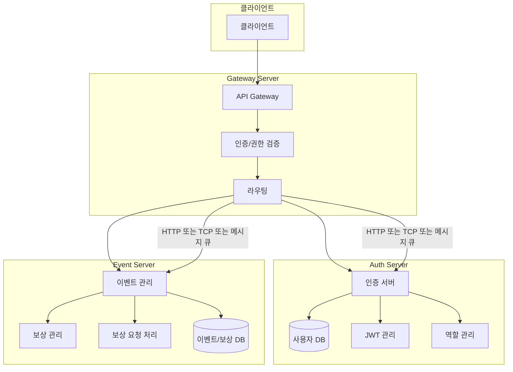

# 이벤트/보상 관리 시스템

NestJS + MSA + MongoDB 기반의 이벤트/보상 관리 시스템입니다.

## 시스템 구조

이 프로젝트는 다음과 같은 3개의 서버로 구성됩니다:

1. **Gateway Server**: 모든 API 진입점, JWT 검증 및 역할(Role) 검사
2. **Auth Server**: 사용자 관리, 인증, JWT 발급
3. **Event Server**: 이벤트 관리, 보상 관리, 조건 검증


## 실행 방법

### 사전 요구사항

- Docker
- Docker Compose

### 설치 및 실행

1. 저장소 클론

```bash
git clone https://github.com/your-username/event-reward-platform.git
cd event-reward-platform
```

2. Docker Compose로 서비스 시작

```bash
docker-compose up -d
```

3. 서비스 접근

- Gateway API: http://localhost:3000
- Auth API: http://localhost:3001
- Event API: http://localhost:3002

## API 문서

각 서버의 API 문서는 Swagger를 통해 확인할 수 있습니다:

- Gateway API 문서: http://localhost:3000/api
- Auth API 문서: http://localhost:3001/api
- Event API 문서: http://localhost:3002/api

## 설계 선택 이유
 todo : 


