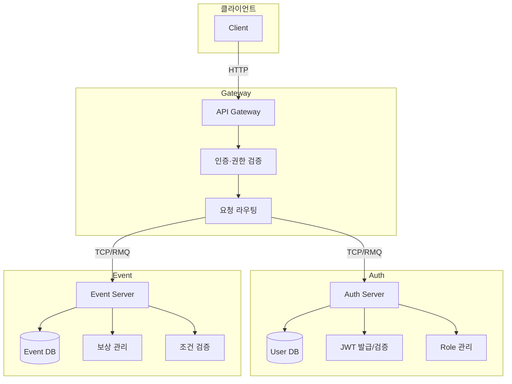

# 이벤트/보상 관리 시스템

NestJS 기반 MSA(Microservice Architecture) + MongoDB로 구현한 이벤트·보상 관리 플랫폼 프로젝트입니다.

---

## 목차

1. [설치 및 실행](#설치-및-실행)
2. [시스템 구조](#시스템-구조)
3. [주요 기능](#주요-기능)
4. [API 문서](#api-문서)
5. [인증 및 권한 관리](#인증-및-권한-관리)
6. [설계 선택 이유](#설계-선택-이유)
7. [메시지 큐 구성](#메시지-큐-구성)
8. [페이징 전략](#KeySet-기반-페이징-전략-도입)
9. [조건 검증 방식](#조건-검증-방식)
10. [테스트 시나리오](#테스트-시나리오)
11. [향후 개선 사항](#향후-개선-사항)

---

## 설치 및 실행

### 사전 요구조건

* Docker
* Docker Compose

### 프로젝트 클론 및 실행

```bash
git clone https://github.com/DongHoonYu96/event-reward-platform.git
cd event-reward-platform
docker-compose up -d
```

* **Gateway**: [http://localhost:3004](http://localhost:3004)
* **Swagger (Gateway)**: [http://localhost:3004/api](http://localhost:3004/api)
* **Auth Server**: TCP/RMQ로 접근 (3001 : swagger용 포트)
* **Event Server**: TCP/RMQ로 접근 (3002 : swagger용 포트)

## 시스템 구조



* **Gateway Server**: 모든 진입점, JWT 권한 검사, 라우팅 담당
* **Auth Server**: 사용자 관리·인증·JWT 발급·Role 관리
* **Event Server**: 이벤트·보상 CRUD, 조건 검사, 보상 요청 처리

## 주요 기능

* 이벤트 라이프사이클: DRAFT, ACTIVE, INACTIVE, COMPLETED
* 조건 검증: CONTINUOUS\_LOGIN, FRIEND\_INVITE, CUSTOM 지원
* 보상 타입: POINT, ITEM, COUPON 등
* 출석 집계 및 기간별 통계
* Keyset 페이징 지원


## API 문서

각 게이트웨이 서버의 Swagger UI를 통해 엔드포인트 및 요청·응답 예시 확인 가능.
- 
- 
- 

## 인증 및 권한 관리

* JWT 기반 인증 (Bearer Token)
* 헤더: `Authorization: Bearer <token>`
* Role: `OPERATOR`, `AUDITOR`, `ADMIN` 등
* Gateway에서 유저의 권한확인후, 인가 처리, 각각 서버의 엔드포인트로 라우팅
* 단점 : Gateway에서 모든 서비스의 엔드포인트에 대해 의존성이 생기는 문제 

## 설계 선택 이유

### MSA 도입

* 서비스 분리로 독립 배포·확장·장애 격리
* Auth·Event 모듈 단일 책임 원칙 강화

### MongoDB

* 유연한 스키마로 이벤트·조건 필드 확장 용이
* 게임 기획 변경에 따른 스키마 변경 용이
* ERD
  - 

### REST + Message Pattern

* TCP, RabbitMQ, Kafka 등으로 손쉬운 전환
* Command 기반 API 설계로 명확성 확보

## 메시지 큐 구성

### RabbitMQ 적용
* 도입배경
  * 기존 TCP 통신 방식의 문제 발견
    - 특정 서버 장애 시 메시지 유실 문제 발생
    - 서비스 간 강한 결합도
    - 장애 상황에서의 복구 어려움

```typescript
// Gateway: Auth 모듈 설정 예시
ClientsModule.registerAsync([
  {
    name: 'AUTH_SERVICE',
    useFactory: (cfg: ConfigService) => ({
      transport: Transport.RMQ,
      options: { urls: [cfg.get('RABBITMQ_URI')], queue: 'auth' }
    }),
    inject: [ConfigService]
  }
]);
```

* `auth`, `event` 큐로 분리 서비스 간 결합도 완화
* 서비스 서버 장애 발생 시에도 메시지 유실 방지
* 서버 재기동 후 큐에 저장된 메시지 자동 처리

## KeySet 기반 페이징 전략 도입

- **Offset 기반 페이징 (SKIP, LIMIT) 페이징 방식**:
    - event, claim 을 findAll로 조회시 비효율 발생
    - SKIP 할 데이터를 메모리에 로드 하고 버리는 비효율적인 동작방식
    - 데이터가 많아질수록 성능 저하 심화

- **keySet 기반 페이징**:
    - 이전 페이지의 마지막 키를 기준으로 다음 페이지 조회
    - 데이터가 많아지더라도 limit 만큼의 데이터만 메모리에 로드
    - MongoDB의 `_id` 필드를 기준으로 구현
    - 몽고 db의 '_id' 필드는 시간정보가 포함되어 있어, 최근 데이터를 쉽게 조회 가능 (별도의 createdAt 인덱싱 불필요)

## 조건 검증 방식
 - 출석 집계 모듈
   - 중복 없는 출석일 체크를 위해 `attendanceDates` 필드에 년-월-일 형식으로 오늘 날짜를 추가
   - `$addToSet` 연산자를 사용하여 중복된 날짜는 추가되지 않도록 처리
   - 출석 집계 기간을 설정하기 위해 `startDate`와 `endDate`를 기준으로 출석일 수를 카운트
```typescript
// attendanceDates: string[]
await this.userModel.updateOne(
  { _id: userId },
  { $addToSet: { attendanceDates: today } }
);
```

```typescript
const count = await this.userModel.aggregate([
  { $match: { _id: ObjectId(userId) } },
  { $unwind: '$attendanceDates' },
  { $match: { attendanceDates: { $gte: startDate, $lte: endDate } } },
  { $count: 'total' }
]);
```

## 테스트 시나리오
- 핵심 로직인 보상 요청에 대해 e2e test 수행

| 시나리오 | 내용                                                |
| ---- | ------------------------------------------------- |
| 1    | Admin/User 생성 → 이벤트·보상 생성 → User 보상 요청 → 승인/거절 검증 |
| 2    | 중복 보상 요청 처리 → 거절 기록 검증                            |

```bash
cd e2e
docker-compose up e2e
```

## 향후 개선 사항

* 출석 집계 최적화 알고리즘 적용 (현재 집계 방식에서 대량의 요청시 성능저하 검증 필요)
* MongoDB 인덱스 최적화
* Gateway·RabbitMQ 단일 장애점 제거
* 단위·통합·E2E 테스트 커버리지 확대
* DTO/Response 구조 개선
