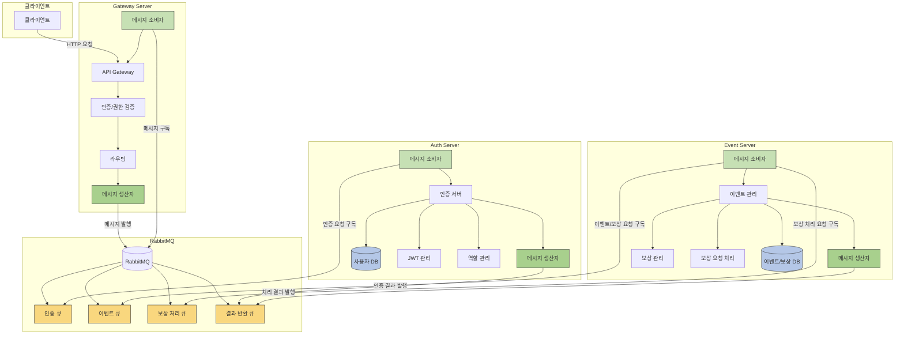
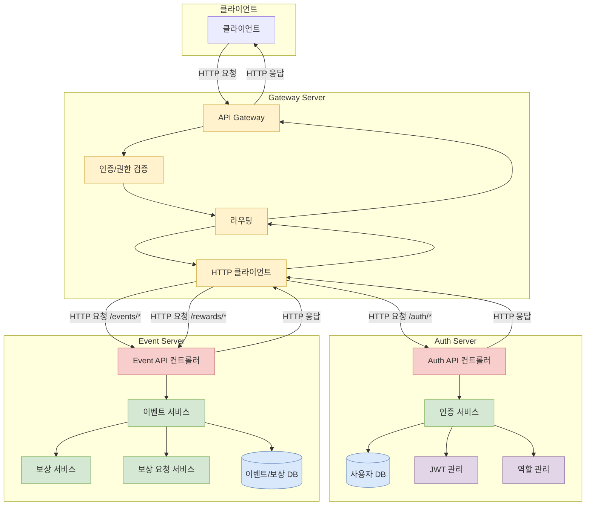

```mermaid
flowchart TB
    subgraph "클라이언트"
        Client[클라이언트]
    end

    subgraph "Gateway Server"
        GW[API Gateway]
        GAUTH[인증/권한 검증]
        GROUTE[라우팅]
        G_PRODUCER[메시지 생산자]
        G_CONSUMER[메시지 소비자]
    end

    subgraph "RabbitMQ"
        MQ[(RabbitMQ)]
        AUTH_QUEUE[인증 큐]
        EVENT_QUEUE[이벤트 큐]
        REWARD_QUEUE[보상 처리 큐]
        RESULT_QUEUE[결과 반환 큐]
    end

    subgraph "Auth Server"
        AUTH[인증 서버]
        A_CONSUMER[메시지 소비자]
        A_PRODUCER[메시지 생산자]
        USER_DB[(사용자 DB)]
        JWT[JWT 관리]
        ROLE[역할 관리]
    end

    subgraph "Event Server"
        EVENT[이벤트 관리]
        E_CONSUMER[메시지 소비자]
        E_PRODUCER[메시지 생산자]
        REWARD[보상 관리]
        REQ[보상 요청 처리]
        EVENT_DB[(이벤트/보상 DB)]
    end

    %% 클라이언트와 Gateway 간 통신
    Client -- "HTTP 요청" --> GW
    GW --> GAUTH
    GAUTH --> GROUTE
    
    %% RabbitMQ 연결
    MQ --> AUTH_QUEUE
    MQ --> EVENT_QUEUE
    MQ --> REWARD_QUEUE
    MQ --> RESULT_QUEUE
    
    %% Gateway와 RabbitMQ 통신
    GROUTE --> G_PRODUCER
    G_PRODUCER -- "메시지 발행" --> MQ
    G_CONSUMER -- "메시지 구독" --> MQ
    G_CONSUMER --> GW
    
    %% Auth Server와 RabbitMQ 통신
    A_CONSUMER -- "인증 요청 구독" --> AUTH_QUEUE
    A_CONSUMER --> AUTH
    AUTH --> USER_DB
    AUTH --> JWT
    AUTH --> ROLE
    AUTH --> A_PRODUCER
    A_PRODUCER -- "인증 결과 발행" --> RESULT_QUEUE
    
    %% Event Server와 RabbitMQ 통신
    E_CONSUMER -- "이벤트/보상 요청 구독" --> EVENT_QUEUE
    E_CONSUMER -- "보상 처리 요청 구독" --> REWARD_QUEUE
    E_CONSUMER --> EVENT
    EVENT --> EVENT_DB
    EVENT --> REWARD
    EVENT --> REQ
    EVENT --> E_PRODUCER
    E_PRODUCER -- "처리 결과 발행" --> RESULT_QUEUE
    
    %% 데이터 흐름 설명
    classDef queue fill:#f9d77e,stroke:#333,stroke-width:1px
    class AUTH_QUEUE,EVENT_QUEUE,REWARD_QUEUE,RESULT_QUEUE queue
    
    classDef producer fill:#a8d08d,stroke:#333,stroke-width:1px
    class G_PRODUCER,A_PRODUCER,E_PRODUCER producer
    
    classDef consumer fill:#c6e0b4,stroke:#333,stroke-width:1px
    class G_CONSUMER,A_CONSUMER,E_CONSUMER consumer
    
    classDef database fill:#b4c7e7,stroke:#333,stroke-width:1px
    class USER_DB,EVENT_DB database
```

```mermaid
flowchart TB
    subgraph "클라이언트"
        Client[클라이언트]
    end

    subgraph "Gateway Server"
        GW[API Gateway]
        GAUTH[인증/권한 검증]
        GROUTE[라우팅]
        HTTP_CLIENT[HTTP 클라이언트]
    end

    subgraph "Auth Server"
        AUTH_API[Auth API 컨트롤러]
        AUTH[인증 서비스]
        USER_DB[(사용자 DB)]
        JWT[JWT 관리]
        ROLE[역할 관리]
    end

    subgraph "Event Server"
        EVENT_API[Event API 컨트롤러]
        EVENT[이벤트 서비스]
        REWARD[보상 서비스]
        REQ[보상 요청 서비스]
        EVENT_DB[(이벤트/보상 DB)]
    end

    %% 클라이언트와 Gateway 간 통신
    Client -- "HTTP 요청" --> GW
    GW --> GAUTH
    GAUTH --> GROUTE
    
    %% Gateway와 Auth Server 간 통신
    GROUTE --> HTTP_CLIENT
    HTTP_CLIENT -- "HTTP 요청 /auth/*" --> AUTH_API
    AUTH_API --> AUTH
    AUTH --> USER_DB
    AUTH --> JWT
    AUTH --> ROLE
    AUTH_API -- "HTTP 응답" --> HTTP_CLIENT
    
    %% Gateway와 Event Server 간 통신
    HTTP_CLIENT -- "HTTP 요청 /events/*" --> EVENT_API
    HTTP_CLIENT -- "HTTP 요청 /rewards/*" --> EVENT_API
    EVENT_API --> EVENT
    EVENT --> EVENT_DB
    EVENT --> REWARD
    EVENT --> REQ
    EVENT_API -- "HTTP 응답" --> HTTP_CLIENT
    HTTP_CLIENT --> GROUTE
    GROUTE --> GW
    GW -- "HTTP 응답" --> Client
    
    %% 컴포넌트 스타일 정의
    classDef controller fill:#f8cecc,stroke:#b85450,stroke-width:1px
    class AUTH_API,EVENT_API controller
    
    classDef service fill:#d5e8d4,stroke:#82b366,stroke-width:1px
    class AUTH,EVENT,REWARD,REQ service
    
    classDef middleware fill:#fff2cc,stroke:#d6b656,stroke-width:1px
    class GW,GAUTH,GROUTE,HTTP_CLIENT middleware
    
    classDef database fill:#dae8fc,stroke:#6c8ebf,stroke-width:1px
    class USER_DB,EVENT_DB database
    
    classDef util fill:#e1d5e7,stroke:#9673a6,stroke-width:1px
    class JWT,ROLE util
```