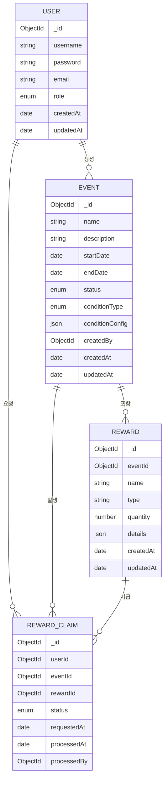

## 1:N (일대다) 관계
- User → Event: 한 사용자는 여러 이벤트를 생성할 수 있음 (1:N)
- User → RewardClaim: 한 사용자는 여러 보상 요청을 할 수 있음 (1:N)
- Event → Reward: 한 이벤트는 여러 보상을 포함할 수 있음 (1:N)
- Event → RewardClaim: 한 이벤트에 대해 여러 보상 요청이 있을 수 있음 (1:N)
- Reward → RewardClaim: 한 보상 유형에 대해 여러 보상 요청이 있을 수 있음 (1:N)
## N:M (다대다) 관계
- User ↔ Event: 사용자와 이벤트 사이에는 RewardClaim을 통한 간접적인 다대다 관계가 존재
  - 한 사용자는 여러 이벤트에 참여할 수 있음
  - 한 이벤트에는 여러 사용자가 참여할 수 있음
  - RewardClaim 엔티티가 이 관계를 중개함
- User ↔ Reward: 사용자와 보상 사이에도 RewardClaim을 통한 간접적인 다대다 관계가 존재
  - 한 사용자는 여러 종류의 보상을 받을 수 있음
  - 한 보상은 여러 사용자에게 지급될 수 있음
  - RewardClaim 엔티티가 이 관계를 중개함